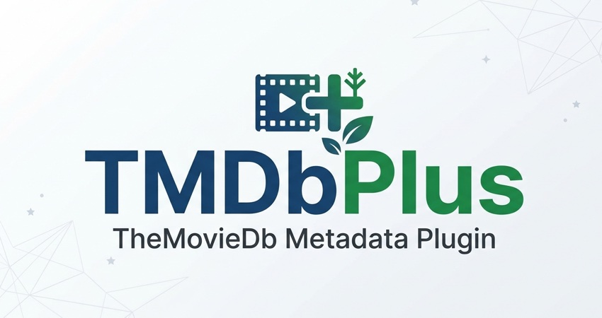

# jellyfin-plugin-tmdbplus

[](https://github.com/cxfksword/jellyfin-plugin-tmdbplus/releases)
[](https://github.com/cxfksword/jellyfin-plugin-tmdbplus/releases)
[](https://github.com/cxfksword/jellyfin-plugin-tmdbplus/main/LICENSE) 

jellyfin电影元数据插件，使用TheMovieDb（TMDB）获取电影与剧集元数据。

功能：
* 支持从TMDB获取元数据
* 兼容anime动画命名格式



## 安装插件

添加插件存储库：

国内加速：https://ghfast.top/https://github.com/cxfksword/jellyfin-plugin-tmdb-plus/releases/download/manifest/manifest_cn.json

国外访问：https://github.com/cxfksword/jellyfin-plugin-tmdb-plus/releases/download/manifest/manifest.json

> 如果都无法访问，可以直接从 [Release](https://github.com/cxfksword/jellyfin-plugin-tmdb-plus/releases) 页面下载，并解压到 jellyfin 插件目录中使用

## 如何使用

1. 安装后，先进入`控制台 -> 插件`，查看下TMDbPlus插件是否是**Active**状态
2. 进入`控制台 -> 媒体库`，点击任一媒体库进入配置页，在元数据下载器选项中勾选**TMDbPlus**，并把**TMDbPlus**移动到第一位

    
   
3. 识别时可在插件配置中控制是否显示TheMovieDb搜索结果
4. 假如网络原因访问TheMovieDb比较慢，可在插件配置中关闭部分TMDB功能

## How to build

1. Clone or download this repository

2. Ensure you have .NET Core SDK 9.0 setup and installed

3. Build plugin with following command.

```sh
dotnet restore 
dotnet publish --configuration=Release Jellyfin.Plugin.TMDbPlus/Jellyfin.Plugin.TMDbPlus.csproj
```


## How to test

1. Build the plugin

2. Create a folder, like `tmdbplus` and copy  `./Jellyfin.Plugin.TMDbPlus/bin/Release/net9.0/Jellyfin.Plugin.TMDbPlus.dll` into it

3. Move folder `tmdbplus` to jellyfin `data/plugins` folder


## FAQ

1. Plugin run in error: `System.BadImageFormatException: Bad IL format.` 
   
   Remove all hidden file and `meta.json` in `tmdbplus` plugin folder


## Thanks

[AnitomySharp](https://github.com/chu-shen/AnitomySharp)

## 免责声明

本项目代码仅用于学习交流编程技术，下载后请勿用于商业用途。

如果本项目存在侵犯您的合法权益的情况，请及时与开发者联系，开发者将会及时删除有关内容。